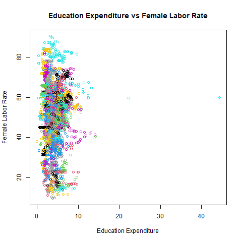
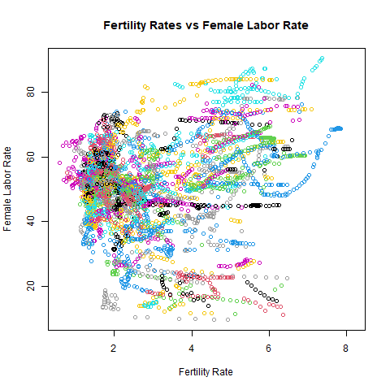
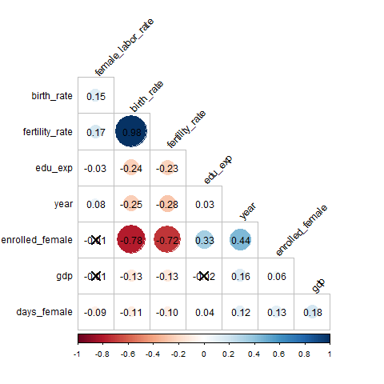

```{r setup, include=FALSE}
knitr::opts_chunk$set(echo = TRUE)
load("12_dataSaving.RData")
```

# Abstract:

Using data from the World Bank, we ran multiple different regression models to explore the effects that education expenditure and fertility rates have on female labor force participation. By using other variables like parental leave and tertiary school enrollment as control variables we are able to reduce omitted variable bias. After running multiple different models we found that higher education expenditure associates with higher female labor force participation. Fertility rates however, displayed a non-linear, U-shaped relationship with female labor force participation. Understanding of these relationships can assist policy makers with improving labor market outcomes and overall economic performance.

# Introduction:
The purpose of this analysis is the examine the relationships between specific variables and the female labor participation rate. We focus mainly on how government expenditure on education affects the female labor participation rate and on how the fertility rate affects the female labor participation rate. We utilize regression modeling tools to measure the effect that these variables have on the female labor force participation rate. By exploring how the female labor force participation rate is affected numerous variables, we can understand how the female labor force participation rate affects the overall economy. Having this information is important for policy makers in both developing and developed countries. Increased female labor participation leads to lower poverty rates and more stable households. This information can be used to bring about economic stability and growth, better access to education, and gender equality.

# Data:

Our analysis uses global datasets from the World Bank on female labor participation rates, government expenditure on education, birth rates, fertility rates, parental leave, tertiary school enrollment, and GDP. After removing unnecessary columns and creating consistent column names, we merged all the datasets into one dataframe. We then sorted the countries by the amount of missing values they had and removed any country with over 25% missing values.

### Female Labor Participation Rate:

The female labor participation rate is represented by female_labor_rate in our data. It is a quantitative variable that measures the female labor force participation rate in terms of % of female population ages 15+. It contains data for almost all countries in the world and spans from 1990 to 2024. Data can be found at https://data360.worldbank.org/en/indicator/WB_WDI_SL_TLF_CACT_FE_ZS.

### Government Expenditure on Education

Government expenditure on education is represented by edu_exp in our data. It is a quantitative variable that measures the government expenditure on education in terms of total % of GDP. It contains data for almost all countries in the world and spans from 1970 to 2023. Data can be found at https://data360.worldbank.org/en/indicator/WB_WDI_SE_XPD_TOTL_GD_ZS.

### Birth Rate

Birth rate is represented by birth_rate in our data. It is a quantitative variable that measures the crude birth rate per 1000 people. It contains data globally and spans from 1960 to 2023. Data can be found at https://data360.worldbank.org/en/indicator/WB_WDI_SP_DYN_CBRT_IN.

### Fertility Rate

Fertility rate is represented by fertility_rate in our data. It is a quantitative variable that measures the total total fertility rates in terms of births per woman. It contains data globally and spans from 1960 to 2023. Data can be found at https://data360.worldbank.org/en/indicator/WB_WDI_SP_DYN_TFRT_IN.

### Maternal Leave

Maternal leave is represented by days_female in our data. It is a quantitative variable that measures the total length of paid maternal leave in terms of calendar days. It containts data globally and spans from 1970 to 2023. Data can be found at https://genderdata.worldbank.org/en/indicator/sh-par-leve?.

### Female Tertiary School Erollment

Female tertiary school enrollment is represented by enrolled_female in our data. It is a quantitative variable that measures female tertiary school enrollment in terms of % gross. It contains data globally and spans from 1970 to 2024. Data can be found at http://genderdata.worldbank.org/en/indicator/se-ter-enrrl.

### GDP

GDP is represented by gdp in our data. It is a quantitative variable that measures a country's GDP in terms of US Dollars. It contains data globally that spans from 1960 to 2024. Data can be found at https://data360.worldbank.org/en/indicator/WB_WDI_NY_GDP_MKTP_CD.

# Visualization:

```{r echo = FALSE}

```
Figure 1: Scatter Plot of Education Expenditure and Female Labor Rate for each country.

From Figure 1 we can see that there is no clear relationship between education expenditure and female labor rates. However, we can see that for education expenditure there is a slight right skewed distribution. There are a handful of outliers that may cause issues with future modeling. It would be wise to test a log transformed variable for education expenditure to combat this. 

```{r echo = FALSE}

```
Figure 2: Scatter Plot of Fertility Rate and Female Labor Rate across countries.

In Figure 2, we see that there is no obvious relationship between fertility rate and female labor rate. When we look at individual countries, represented by different colors, we can see that each country has its own unique pattern. Fertility rate seems to affect the female labor force pariticipation rate differently for each country. This makes sense and we should see a clearer and more significant relationship between the two variables once we introduce other variables. 

```{r echo = FALSE}

```
Figure 3: Correlation Matrix across all variables.

Figure 3 shows us the correlation between all variables in our data. Birth rate and fertility show extremely high positive correlation. This makes sense as they are fundamentally very similar statistics. We will have to be very careful when modeling both of these variables as we would risk collinearity. Female tertiary school enrollment has very high negative correlation with birth rate and fertility rate. It seems that as more women enter higher education, less children are born. There is a very weak negative significant relationship between education expenditure and female labor force participation. This is very strange as we expect there to be a stronger positive correlation between the two variables. Running a model with these two variables and other variables could provide more information on the behavior of this relationship. GDP seems to not have a significant effect on the female labor force participation rate. We can include it in initial models, but potentially look to omit if it seems to provide no value to the model.

# Analysis:

